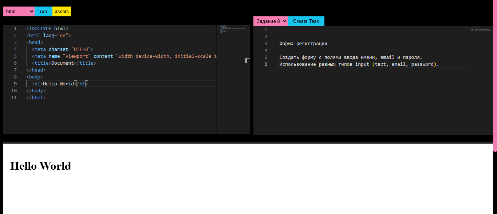

## BlockSpace - codeSpace online

  

  
  
  
  

---
## Overview
BlockSpace - its mini codeSpace app build with 
TS JS SCSS HTML CSS

Users can write code and languages such as js css html

---

## Features
- beautiful visual
- clear ux
- errors handing
- supporting js

---

## Architecture
- @monaco-editor/react
- react
- vite

---
## Screen 

  

---

## How to Run
1. Clone the repository
2. npm install
3. npm run dev

---
## License
Educational project created for learning and portfolio purposes.
